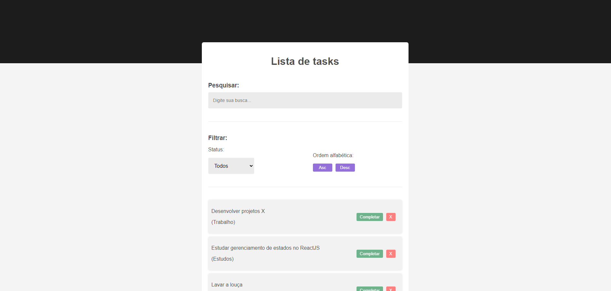

 # Task list
 
 

 ## 📃 sobre o projeto
Esta é uma aplicação web de To Do list, onde é possível criar tasks (tarefas) escolhendo entre três categorias; pessoal, estudos e trabalho. </br>

A ferramenta também conta com opções de filtros, send possível filtrar por tasks completas e incompletas, como também lista-las por ordem alfabéticas ascendente e descendente. </br>

🚧 Deploy do projeto em breve... 🚧

## tecnologias utilizadas
- [ReactJS 18](https://react.dev/)
- [Vite](https://vitejs.dev/)
- CSS

## como usar o aplicativo
Para clonar repositório do aplicativo, é necessário possuir o **[node.js](https://nodejs.org/en)** e o **[git](https://www.git-scm.com/downloads)** instalados no computador.
</br>
Você consegue fazer através do NPM (gerenciador de pacotes para node):
</br>

```c++

# clone este repositório
$ git glone github.com/gabrielrojas/task-list.git

# entre no repositório
$ cd task-list

# instale as dependências
$ npm install

# rode o aplicativo em modo de desenvolvimento
$ npm run dev

```

---

 👋 **[dê um oi](https://www.linkedin.com/in/gabriel-rojas-6362a7164/)** em meu Linkedin ou envie um **[e-mail](mailto:contato_gabrielrojas@outlook.com)**
